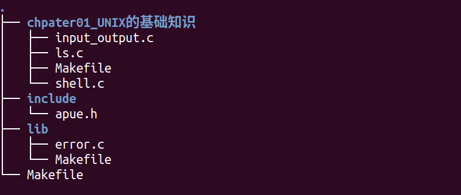
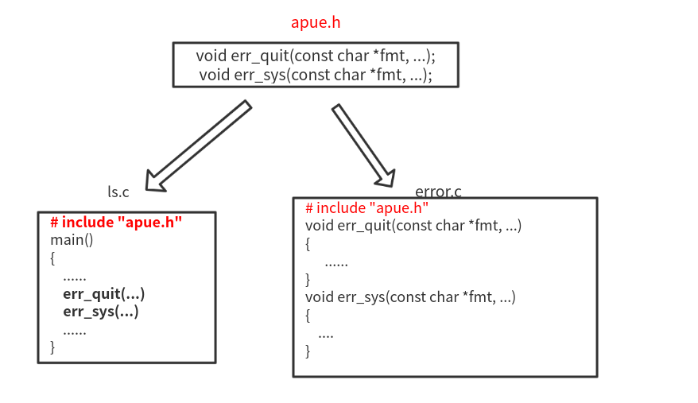

[toc]

## 0. 前言

想整理一篇头文件和库的文章，由来已久。

【我】平时写代码比较少；写代码也就一两百行，用不着头文件；用着头文件，头文件也是和源文件放在一个目录中，一点击编译，基本OK；终其原因，还是缺少一些机遇，写一个大一点规模的代码。怎一个懒字了得。

【我】但是偶尔也会遇到：查找系统头文件的源码，发现只能追踪到头文件；《跟我一起写makefile》中创建库；

**那库和头文件有什么关系呢？我们如何自己创建库和头文件，并使用呢**？


很巧的是，这两天我看到**APUE中代码的编译过程。编译过程简单清晰，挺适合用来举例说明**。

可以参考[APUE-code3e](http://www.apuebook.com/code3e.html) 代码，也可以参考下面的代码；些许差别，不影响本质。

可以[在线看代码](https://github.com/da1234cao/APUE/tree/bc045cc1fd353386a765988e3a794e7739a914fb) ,或者下载到本地查看。

```shell
git clone git@github.com:da1234cao/APUE.git
git log
git checkout bc045cc1fd353386a765988e3a794e7739a914fb 
```

代码结构如下所示：`chpater01_UNIX的基础知识`放置源文件；`include`放置头文件；`lib`放置库；`各个Makefile`层级编译代码；




下文涉及到的**背景知识点**如下表。

|     知识点     |                             参考                             |
| :------------: | :----------------------------------------------------------: |
|    makefile    |                    《跟我一起写makefile》                    |
| 源文件与头文件 |       《c语言程序设计现代方法》第十五章编写大规模程序        |
|  库的基本理解  | [C++静态库与动态库](https://www.cnblogs.com/skynet/p/3372855.html) |


## 1. 摘要

用示例展示头文件和静态库的创建和调用。我们先准备好需要的源代码，再组织Makefile的代码结构。理解Makefile的编译过程，即理解了头文件和库之间的关系。（就这么简单！）


## 2. 源代码



### 2.1 功能代码

查看指定目录下，有哪些文件。即，实现一个最简单的`ls`功能。

（我去下载了`ls`的[源码](https://github.com/coreutils)，瞄了一眼，代码是有点相当长。）

**代码中`err_quit()`和`err_sys()` 函数，在库中实现，使用`#include "apue.h"`声明** 。

```c
/**
 * 文件名：chpater01_UNIX的基础知识/ls.c
 * 功能：查看指定目录中，有哪些文件
*/

#include "apue.h"
#include <sys/types.h>
#include <dirent.h>

int main(int argc , char* argv[]){
    DIR *dp;
    struct dirent *dirp;

    if(argc!=2){
        err_quit("usage: ls directory_name");
    }
    if((dp = opendir(argv[1])) == NULL){
        err_sys("fail open %s",argv[1]);
    }

    while ( (dirp = readdir(dp)) != NULL){
        printf("%s\n",dirp->d_name);
    }
    
    closedir(dp);
    return 0;
}
```

### 2.2 头文件

头文件中定义了函数声明。

```c
/**
 * 文件名：include/apue.h
*/

#ifndef _APUE_H
#define _APUE_H

#include <stdio.h>
#include <stdlib.h>
#include <string.h>
#include <stdarg.h>
#include <errno.h>

#define	MAXLINE	4096			/* max line length */

/**
 * 作用：打印错误信息，并退出；
 * __attribute__((noreturn)): 
 * 的作用告诉编译器这个函数不会返回给调用者，
 * 以便编译器在优化时去掉不必要的函数返回代码
*/
void err_quit(const char *fmt, ...) __attribute__((noreturn)) ;


/**
 * 打印和系统调用的错误信息，并退出
*/
void err_sys(const char *fmt, ...);

#endif
```

### 2.3 库函数

库函数包含具体实现代码。

```c
#include "apue.h" //加上这个头文件，便于编译器检查apue.h中的原型和这里相匹配，

static void err_doit(int errorflag,int error, const char *fmt, va_list ap);

/**
 * 打印错误信息，并退出
*/
void err_quit(const char *fmt, ...){
    va_list ap;
    va_start(ap,fmt);
    err_doit(0,0,fmt,ap);
    va_end(ap);
    exit(1);
}


/**
 * 打印和系统调用的错误信息，并退出
*/
void err_sys(const char *fmt, ...){
	va_list		ap;

	va_start(ap, fmt);
	err_doit(1, errno, fmt, ap);
	va_end(ap);
	exit(1);
}

/**
 * static 函数，仅在该文件中可见
 * 打印错误信息
*/
static void err_doit(int errorflag,int error, const char *fmt, va_list ap){
    char buf[MAXLINE];

    vsnprintf(buf,MAXLINE-1,fmt,ap);
    if(errorflag){
        snprintf(buf+strlen(buf),MAXLINE-strlen(buf)-1,":%s",strerror(error));
    }
    strcat(buf,"\n");
    fflush(stdout);
    fputs(buf,stderr);
    fflush(NULL);
}
```


## 3. 编译过程

### 3.0 不用makefile

编译生成静态库：**将.o文件打包，即生成了静态库。这里是库函数的具体实现**。

```shell
# 先编译生成静态库
gcc -I../include -c error.c -o error.o
ar crv libapue.a error.o
```

编译源文件：指定头文件和静态库的位置。

**头文件是为了导入库函数声明，静态库中是库函数的具体实现**。

```shell
gcc -I../include ls.c -o ls  -L../lib -lapue
```

不用makefile编译比较麻烦，下面是makefile的实现。

### 3.1 第一层Makefile

```makefile
ROOT ?= $(shell pwd)

export CC=gcc
export LDFLAGS=
export LDDIR=-L$(ROOT)/lib
export LDLIBS=$(LDDIR) -lapue $(EXTRALIBS)
export LIBAPUE=$(ROOT)/lib/libapue.a
export CFLAGS=-I$(ROOT)/include

DIRS = lib chpater01_UNIX的基础知识

all:
	for i in $(DIRS); do \
		(cd $$i && echo "cd and making $$i" && $(MAKE) ) || exit 1; \
	done

clean:
	for i in $(DIRS); do \
		(cd $$i && echo "cd and cleaning $$i" && $(MAKE) clean) || exit 1; \
	done
```

### 3.2 第二层Makefile：库的生成

```makefile
LIBMISC	= libapue.a
OBJS   = error.o

all:	$(LIBMISC)

$(LIBMISC):	$(OBJS)
	ar crv $(LIBMISC) $?
	echo "make $(LIBMISC)"

%.o : %.c
	$(CC) $(CFLAGS) -c $< -o $@

clean:
	rm -f *.o a.out $(LIBMISC)
```

### 3.3 第二层Makefile：源文件的编译

```makefile
PROGS =	ls input_output shell

all:	$(PROGS)

%:	%.c $(LIBAPUE)
	$(CC) $(CFLAGS) $@.c -o $@ $(LDFLAGS) $(LDLIBS)

clean:
	rm -f $(PROGS) *.o
```


## 4. 总结

是不是相当简单～

在源文件中导入头文件，`gcc`编译的时候，使用`-I`参数指定头文件的位置。头文件一般是函数的声明，数据结构等，当然也可以直接在头文件中定义和实现一个函数。

一般而言，头文件中声明函数，函数具体的实现放在另一个文件中。该文件也需要包含头文件，便于编译器检查函数原型和头文件相匹配。当有多个这样的文件的时候，我们可以使用`ar`打包方式生成库。使用`-L`参数指定库的位置。

头文件相当于库的大纲，库中是具体的代码实现。所以编译一个文件的时候，需要同时指定头文件和与头文件对应的库，从而将库函数的具体实现包含进来。

以上。

